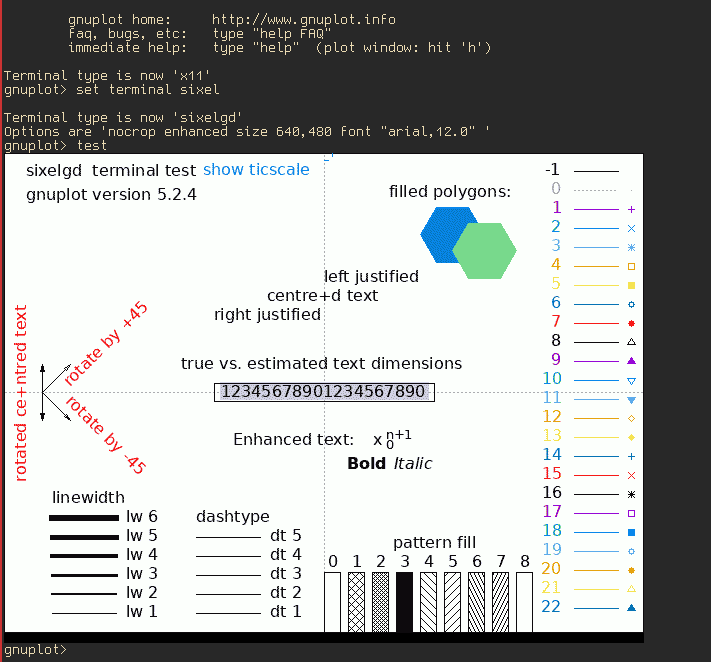

# st

**ATTENTION**: this repo is no longer maintained, I don't use `st` anymore, and
have switched to `uxterm`.

This is a fork of the excellent [st](https://st.suckless.org/) terminal by
Suckless (most recently based on st-0.8.1). `st` is configured by forking and
applying appropriate patching and source modifications. This repository
constitutes my personal configuration of `st`.

## Changes From the Default:

*st displaying a gnuplot test to demonstrate sixel graphics support*

* All [scrollback](https://st.suckless.org/patches/scrollback/) patches have
  been applied.
* The colorscheme has been set to [gruvbox](https://github.com/morhetz/gruvbox).
* The font has been set to [gohufont](http://font.gohu.org/).
* The cursor has been configured to be a red I-beam style.
* Experimental support for sixel graphics has been added. There are several
  known issues:
	* Entering `clear` causes *all* sixels to be deleted from scrollback.
	* Rendering sixel graphics may cause unusual cursor placement, this is
	  not specific to this variant of st - the same issue is present in
	  the xterm implementation. This is likely an issue of sixel height
	  not being detected correctly.
* Preliminary support for some additional control sequences has been added,
  namely OSC 11 and 10 with more planned.
* CSI S and T escape behavior has been modified to fix a bug where S or T
  escapes would sometimes cause lines to be deleted from the scrollback buffer.

## Attribution

Almost all of the code in this repository is not my work, but the work of the
suckless engineering team (see suckless.org) or other members of the suckless
community. This code is used with permission as defined in the [suckless
license](https://git.suckless.org/st/file/LICENSE.html).

Sixel-graphics related code was taken from this diff
https://gist.github.com/saitoha/70e0fdf22e3e8f63ce937c7f7da71809 and modified.
This looks like it has some GPL licensed code in it, so you should probably
consider my fork to be GPL also.

All modifications that constitute my own own original work are (c) 2018 Charles
Daniels, All Rights Reserved, and may be considered available under the terms
of the suckless license.

## See Also

The original README file for `st` may be viewed in the file `orig_README`.
